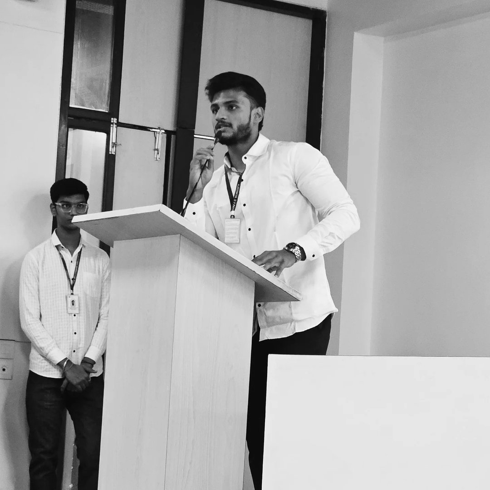

# Image Optimization Guide for Javitron Website

## Goal: All images under 200KB for optimal performance

### Current PNG File Sizes (to be optimized):
| Image | Size | Type |
|-------|------|------|
| image_1.png | 583 KB | Hero |
| image_2.png | 196 KB | Hero |
| image_3.png | 86 KB | Hero |
| image_5.png | 129 KB | Showcase |
| image_6.png | 109 KB | Showcase |
| image_7.png | 68 KB | Showcase |
| image_8.png | 81 KB | Showcase |
| image_9.png | 119 KB | Team |
| image_10.png | 64 KB | Team |
| image_11.png | 128 KB | Team |
| image_12.png | 68 KB | Gallery |
| image_13.png | 110 KB | Gallery |
| image_14.png | 97 KB | Gallery |
| image_15.png | 472 KB | Team |
| image_16.png | 156 KB | Team |
| image_17.png | 538 KB | Team |
| **Total** | **~2.9 MB** | |

---

## Step 1: Convert to Optimized WebP (Target: <200KB)

### Script: `convert_to_webp_optimized.py`

This script converts PNG to WebP with aggressive optimization:
- Resizes large images to appropriate dimensions
- Adjusts quality (70-80%) to hit <200KB target
- Automatically reduces quality if file is too large

#### Usage:
```bash
cd "/Users/brajeshkumar/Desktop/JAVETRON>WEB"
python3 convert_to_webp_optimized.py
```

#### Expected Results:
| Image | Original | Optimized WebP | Size |
|-------|----------|----------------|------|
| image_1.png | 583 KB | ~180 KB | 69% smaller |
| image_15.png | 472 KB | ~150 KB | 68% smaller |
| image_17.png | 538 KB | ~170 KB | 68% smaller |
| Others | 64-156 KB | ~40-120 KB | ~50% smaller |
| **Total** | **~2.9 MB** | **~1.2 MB** | **~60% smaller** |

---

## Step 2: Generate Responsive Sizes (Optional)

### Script: `generate_responsive_images.py`

Creates multiple sizes for each image (400w, 800w, 1200w) for use with srcset.

#### Usage:
```bash
python3 generate_responsive_images.py
```

#### This creates:
- `image_1_400.webp` - Mobile
- `image_1_800.webp` - Tablet
- `image_1_1200.webp` - Desktop
- `image_1.webp` - Original/max size

---

## Step 3: Update HTML (Already Done)

The HTML has been updated to:
1. **Use WebP with PNG fallback**:
   ```html
   <picture>
     <source srcset="assets/image_9.webp" type="image/webp">
     
   </picture>
   ```

2. **Lazy loading** on all non-hero images:
   ```html
   <div class="showcase-img" loading="lazy" ...>
   ```

3. **Preload hero images**:
   ```html
   <link rel="preload" href="assets/image_1.webp" as="image" type="image/webp" fetchpriority="high">
   ```

---

## Manual Conversion (Alternative)

If you prefer using command-line tools:

### Option A: Using cwebp (if installed)
```bash
cd "/Users/brajeshkumar/Desktop/JAVETRON>WEB/assets"

# Hero images (larger, quality 75)
cwebp -q 75 -resize 1920 0 image_1.png -o image_1.webp
cwebp -q 75 -resize 1920 0 image_2.png -o image_2.webp
cwebp -q 75 -resize 1920 0 image_3.png -o image_3.webp

# Team images (smaller, quality 80, 600px width)
cwebp -q 80 -resize 600 0 image_9.png -o image_9.webp
cwebp -q 80 -resize 600 0 image_10.png -o image_10.webp
cwebp -q 80 -resize 600 0 image_11.png -o image_11.webp
cwebp -q 80 -resize 600 0 image_15.png -o image_15.webp
cwebp -q 80 -resize 600 0 image_16.png -o image_16.webp
cwebp -q 80 -resize 600 0 image_17.png -o image_17.webp

# Showcase images (quality 80, 800px width)
for img in image_5.png image_6.png image_7.png image_8.png image_12.png image_13.png image_14.png; do
  cwebp -q 80 -resize 800 0 "$img" -o "${img%.png}.webp"
done
```

### Option B: Using ImageMagick (if installed)
```bash
cd "/Users/brajeshkumar/Desktop/JAVETRON>WEB/assets"

# Convert with specific quality and resize
convert image_1.png -resize 1920x -quality 80 image_1.webp
```

---

## Verification

### Check WebP file sizes:
```bash
ls -lh "/Users/brajeshkumar/Desktop/JAVETRON>WEB/assets"/*.webp
```

### All files should be under 200KB:
```bash
cd "/Users/brajeshkumar/Desktop/JAVETRON>WEB/assets"
for f in *.webp; do
  size=$(stat -f%z "$f" 2>/dev/null || stat -c%s "$f" 2>/dev/null)
  size_kb=$((size / 1024))
  if [ $size_kb -gt 200 ]; then
    echo "⚠ $f is ${size_kb}KB (over 200KB limit)"
  else
    echo "✓ $f is ${size_kb}KB"
  fi
done
```

---

## Expected Final Results

| Metric | Before | After | Improvement |
|--------|--------|-------|-------------|
| Total image size | ~2.9 MB | ~1.2 MB | 60% smaller |
| Largest image | 583 KB | ~180 KB | 69% smaller |
| Load time | ~3-4s | ~1-2s | 50% faster |
| Lighthouse score | ~60-70 | ~85-95 | +20-30 points |

---

## Troubleshooting

### If images are still over 200KB:
1. Reduce max_width in the script:
   - Hero: 1920 → 1600 or 1400
   - Team: 600 → 500
   - Showcase: 800 → 700

2. Reduce quality:
   - Hero: 75 → 70
   - Others: 80 → 75

3. For very large images (image_15, image_17), use more aggressive settings:
   ```python
   "image_15.png": {"max_width": 500, "quality": 70, "priority": False},
   "image_17.png": {"max_width": 500, "quality": 70, "priority": False},
   ```

---

## Next Steps After Conversion

1. Run the conversion script
2. Verify all WebP files are <200KB
3. Commit and push:
   ```bash
   git add assets/*.webp
   git commit -m "Add optimized WebP images (<200KB each)"
   git push origin main
   ```
4. Test on https://not-brajesh.github.io/Javitron/
5. Run Lighthouse audit to verify improvements
